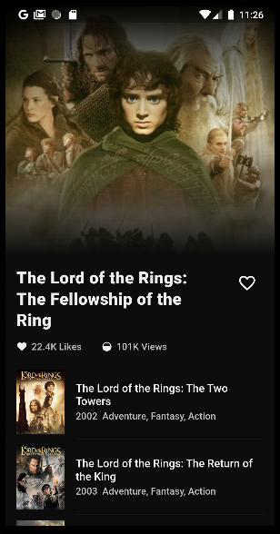

# MOVIE CHALLENGE APP

Este é um aplicativo mobile que exibe informações sobre um filme específico.

 

> API usada: https://developers.themoviedb.org/3/movies/get-movie-details

 

## **Informações técnicas**

 

Este projeto foi desenvolvido utilizando Dart e Flutter, nas seguintes versões:
- Dart: 2.19
- Flutter: 3.7.7
- Testes realizados em: Android (API 27)

 
Este projeto usa as seguintes dependências:

- Dio: para realizar requisições http
- Get It: para injeções de dependência.
- Shared Preferences: para armazenamento na memoria de like/deslike

 

Como arquitetura do projeto foi aplicado o Clean Archicteture (de uma forma mais simplificada), devido ao tamanho do projeto, mas buscando um baixo acoplamento do código, com camadas definidas e classes objetivas, e conforme as boas práticas de desenvolvimento, facilitando reuso, testes, e manutenção. 

Para controle de estado foi utilizado uma opção nativa - o ValueNotifier -, sendo uma das melhores opções recomendadas atualmente pela comunidade, contribuindo para a performance, manutenção e legibilidade, sendo assim a opção escolhida para este projeto. Para injeção de dependencias foi usado o Get It, que é simples e funciona muito bem. Alguns dos Design Patterns usados foi o State para um controle melhor de estado dos filmes, e o Observer para reatividade.

 

## **Funcionalidades**

 

Nesta tela, é exibido os detalhes referentes ao filme selecionado, conforme buscado na API. O botão de Like (icon de coração ao lado do título), salva no armazenamento do dispositivo o estado do botão.

 A baixo das informações do filme principal é exibido uma lista com os filmes similares a ele. Para isso o app usou a função de pesquisa na API e faz uma busca usando algumas palavras do título do filme selecionado, e então é retornado uma lista contendo vários filmes referentes a pesquisa. O sistema remove o primeiro da lista (que é o filme já selecionado e que está sendo exibido os detalhes na tela), e diminui o tamanho da lista para 7.

 
 

## **Testes**

 
Foram realizados testes unitários das camadas datasource, repository e controller, o que ajudou num desenvolvimento mais rápido, rastreando erros e bugs mais rapidamente, mapeando todos os caminhos possiveis ao realizar as requisições Http, e acompanhar o funcionamento das funcionalidades no código.

 
 

## **Manutenção e Melhorias**

 

 
Nos testes, uma das melhorias sugeridas é realizar tambem os testes de integração e de widgets, para ficar mais completo. Nos testes unitários já realizados, falta mapear os caminhos não-felizes, usando mocks. Para isso precisaria de um pouco mais de tempo para desenvolver, usando o mockito ou mocktail. Criando mocks para simular requisições falhas, usando as mais diversas possibilidades, e assim tratando-as.

Nesse sentido, talvez fosse interessante criar repositories abstratos para facilitar estes testes, e inserindo-os no projeto, seguindo assim mais de perto o Clean Archtecture. Até o momento, o projeto foi desenvolvimento de forma mais simples, mas conforme o projeto fosse crescendo, essa mudança se faria necessária.

